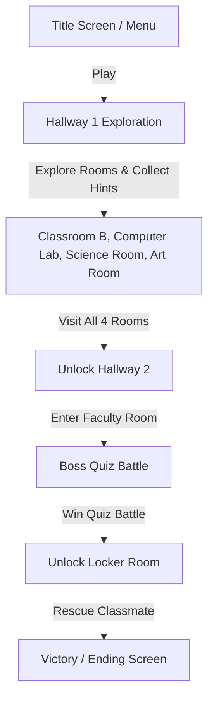

# School Rescue: The Hero's Journey

Welcome to **School Rescue: The Hero's Journey**, a classic 2D retro-style tile-based adventure game built from scratch using Java Swing and AWT. The game follows the journey of **Ron**, the protagonist, who must explore a school, locate educational/puzzle hints in various rooms, defeat a school boss in a quiz battle of wits, and rescue a trapped classmate.

---

## Table of Contents
1. [Game Overview & Flow](#game-overview--flow)
2. [Game Features](#game-features)
3. [Controls Reference](#controls-reference)
4. [Project Directory Structure](#project-directory-structure)
5. [Setup & Installation](#setup--installation)
    - [Prerequisites](#prerequisites)
    - [Building and Running with Apache Ant](#building-and-running-with-apache-ant)
    - [Building and Running Manually via Command Line](#building-and-running-manually-via-command-line)
    - [IDE Setup](#ide-setup)
6. [Architecture & API Documentation](#architecture--api-documentation)
    - [Main Game Classes (`com.main`)](#main-game-classes-commain)
    - [Entities (`entity`)](#entities-entity)
    - [Maps and Environments (`map`)](#maps-and-environments-map)
7. [Technical Concepts & Mechanics](#technical-concepts--mechanics)
    - [Grid-Based Collision System](#grid-based-collision-system)
    - [Game Loop & Rendering Pipeline](#game-loop--rendering-pipeline)
    - [State Management](#state-management)
8. [Deployment & Packaging](#deployment--packaging)
9. [Meet the Development Team](#meet-the-development-team)

---

## Game Overview & Flow



1. **Title Menu:** Players are greeted by an immersive theme song, the title title logo, and options to play, exit, or view credits.
2. **Exploration & Investigations:** Players navigate the hallways and rooms. Inside each room, the player must step on interactive areas to read crucial hints (represented as educational slides/popup images) to prepare for the final test.
3. **Progress Lock:** A hallway guard prevents the player from passing until all rooms have been explored.
4. **Boss Battle:** In the Faculty Room, the player engages in a tactical five-round Quiz Battle. The player and boss each start with 3 life points. Correct answers damage the boss, while incorrect answers damage the player.
5. **The Rescue:** Upon defeating the boss, the player gains entry to the Locker Room, rescuing the classmate and triggering the final ending scene.

---

## Game Features

*   **Custom 2D Tile Engine:** High-performance, lightweight tile-rendering designed for 16x16 pixel retro-style sprites scaled dynamically by $3\times$ to $48\times48$ pixels.
*   **Collision Detection System:** Axis-aligned bounding box (AABB) intersection and coordinates translation to a static 2D boolean collision map matrix for obstacle collisions.
*   **Dialogue Manager:** A message queue dialogue system that scrolls through custom dialog popups.
*   **Interactive Hint Popups:** Custom overlays that present hints when players step on specific puzzle coordinates.
*   **Boss Fight (Quiz Battle):** Image-based multiple-choice questionnaire with graphic life counters for the hero and the boss.
*   **Stateful Environment Rendering:** Dynamic transition from normal school status (`Hallway`) to locked-down status (`Hallway2`) upon triggering exploration conditions.
*   **Audio Controller:** Implements concurrent wav music playback for main menus and gameplay loops using `javax.sound.sampled`.
*   **Pause & Recovery Menu:** Fully-integrated Pause Overlay featuring screen blurring via transparent graphics overlays, allowing players to Continue, Restart, or Quit.

---

## Controls Reference

Below is the layout of controls map supported by the custom keyboard handler.

| Key | Action / Mapping | Context |
| :--- | :--- | :--- |
| **W** | Move Character Up / Navigate Menu Option Up | Gameplay & Pause Menu |
| **S** | Move Character Down / Navigate Menu Option Down | Gameplay & Pause Menu |
| **A** | Move Character Left | Gameplay |
| **D** | Move Character Right | Gameplay |
| **ESC** | Toggle Pause Menu / Resume Game | Gameplay |
| **ENTER** | Confirm Option Selection | Pause Menu |
| **Left Click** | Select Quiz Answer / Close Hint Popups | Quiz Screen / Hints Screen |

---

## Project Directory Structure

The project directory consists of Java sources and resources files structured as follows:

```
school-rescue/
├── .classpath            # Eclipse Classpath Configurations
├── .project              # Eclipse Project Configurations
├── build.xml             # Apache Ant Build Script
├── manifest.mf           # JAR Compilation Manifest File
├── nbproject/            # NetBeans Project Metadata
│   ├── project.xml
│   └── project.properties
├── src/                  # Game Source Code
│   └── com/main/         # Core Game Engines & Controllers
│   └── entity/           # Player, NPCs, & Character Base Classes
│   └── map/              # Individual Level & Map Room Layout Definitions
└── res/                  # Game Asset Resources (added to Classpath)
    ├── ending/           # Ending Cutscene Sprites
    ├── hints/            # Educational Hints & Puzzle Overlays
    ├── map/              # Classroom & Hallway Background Layout PNGs
    ├── player/           # Directional Movement Sprites for Ron
    ├── quiz/             # Boss Sprites, Questions, and Options PNGs
    ├── sound/            # Background Audio and Sound Effects (.wav)
    └── titlescreenbg/    # Main Title Screen Artwork
```

---

## Setup & Installation

### Prerequisites
*   **Java Development Kit (JDK) 21** or later.
*   **Apache Ant** (optional, recommended for compiling via build script).

---

### Building and Running with Apache Ant

The project includes an Ant `build.xml` script that streamlines the compilation, packaging, and execution phases.

1.  Open your terminal or command prompt in the `school-rescue/` root directory.
2.  Compile the source files and launch the application directly:
    ```bash
    ant run
    ```
3.  To clean up compilation artifacts (the `build/` and `dist/` directories):
    ```bash
    ant clean
    ```

---

### Building and Running Manually via Command Line

If you do not have Apache Ant installed, you can compile and execute the game manually using the standard JDK commands.

#### Windows (PowerShell/CMD):
1.  Create a target output directory for compiled class files and assets:
    ```powershell
    mkdir -p build/classes
    ```
2.  Compile all Java files with the classpath including `src` and `res` paths:
    ```powershell
    javac -d build/classes -sourcepath "src;res" src/com/main/FinalsGameMain.java
    ```
3.  Copy asset resources to the output target build folder:
    ```powershell
    xcopy /E /I res build\classes
    ```
4.  Run the application from the build folder:
    ```powershell
    java -cp build/classes com.main.FinalsGameMain
    ```

---

### IDE Setup

*   **NetBeans IDE:** Select *File* $\rightarrow$ *Open Project*, locate and select the `school-rescue` folder. NetBeans automatically reads the `nbproject/` settings. Press `F6` to run.
*   **Eclipse IDE:** Go to *File* $\rightarrow$ *Import* $\rightarrow$ *Existing Projects into Workspace*, browse to the root folder, and select the project. Click Run.
*   **VS Code:** Install the *Extension Pack for Java*. Open the `school-rescue` folder, let the build tools index the Java source code, and run `FinalsGameMain.java` using the VS Code CodeLens.

---

## Architecture & API Documentation

### Main Game Classes (`com.main`)

#### [FinalsGameMain.java](file:///e:/CODEX%20LOUISS/3Y_LOUIS/CollGame/school-rescue/src/com/main/FinalsGameMain.java)
The entry point of the application. It creates a window (`JFrame`), hides structural window decorations, packs content panels, centers the frame on the screen, and instantiates the `TitleScreen` panel.

#### [TitleScreen.java](file:///e:/CODEX%20LOUISS/3Y_LOUIS/CollGame/school-rescue/src/com/main/TitleScreen.java)
Renders the retro title screen background and manages the startup interaction.
*   `playMusic()` / `playGameMusic()`: Controls background audio loop tracks (`titlemusic.wav` and `bgm.wav`).
*   `toggleAboutOverlay()`: Renders the team developer overlay.
*   `startGame()`: Disposes of the Title Menu UI, spins up `GamePanel`, requests focus for key handling, and initiates the game thread.

#### [GamePanel.java](file:///e:/CODEX%20LOUISS/3Y_LOUIS/CollGame/school-rescue/src/com/main/GamePanel.java)
The core heart of the system. Implements `Runnable` and coordinates update-render loops.
*   `tileSize`: Configured at 48 pixels ($16\text{px} \times 3$ scale).
*   `MapState`: Enum tracking coordinates of `HALLWAY`, `ROOM`, `COMPUTERLAB`, `SCIENCEROOM`, `MATHROOM`, `FACULTY`, `HALLWAY2`, and `LOCKERROOM`.
*   `gameUpdate()`: Triggers player movements, collision check updates, map transitions, dialogue timer counts, and ending state triggers.
*   `paintComponent(Graphics g)`: Implements double-buffered canvas drawings of room graphics, characters, dialog grids, and the semi-transparent blurred Pause overlay.

#### [KeyHandler.java](file:///e:/CODEX%20LOUISS/3Y_LOUIS/CollGame/school-rescue/src/com/main/KeyHandler.java)
Implements `KeyListener` to translate keystrokes (`W`, `A`, `S`, `D`, `ESC`, `ENTER`) into boolean states.

#### [QuizBattle.java](file:///e:/CODEX%20LOUISS/3Y_LOUIS/CollGame/school-rescue/src/com/main/QuizBattle.java)
Encapsulates the five-stage boss battle.
*   `mcLife` & `bossLife`: Integer tracking (initialized at 3).
*   `draw(Graphics2D g2, int w, int h)`: Renders combat animations, health status icons (`MC3LIFE.png`, `BOSS3LIFE.png`), and questions.
*   `handleClick(int x, int y)`: Resolves bounding boxes of choices to identify selected answers.

---

### Entities (`entity`)

#### [Entity.java](file:///e:/CODEX%20LOUISS/3Y_LOUIS/CollGame/school-rescue/src/entity/Entity.java)
Abstract base class representing dynamic game characters. Defines position variables (`x`, `y`), speed, movement directions (`up`, `down`, `left`, `right`), animation frames (`up1`, `up2`, etc.), sprite swap counters, and collision status bounds.

#### [Player.java](file:///e:/CODEX%20LOUISS/3Y_LOUIS/CollGame/school-rescue/src/entity/Player.java)
Inherits from `Entity`. Manages movement updates:
*   `update()`: Determines requested coordinates (`nextX`, `nextY`), checks if the path is clear, detects transitions through doorway thresholds, checks if player is hovering over hints, and switches map configurations dynamically.
*   `draw(Graphics2D g2)`: Performs frame swaps to create character walking animations.

#### [NPC.java](file:///e:/CODEX%20LOUISS/3Y_LOUIS/CollGame/school-rescue/src/entity/NPC.java)
Inherits from `Entity`. Models blockades like locked doorway boundaries and manages warning dialogues.

---

### Maps and Environments (`map`)

Each classroom and hallway is represented by a dedicated class within the `map` package (e.g., `Hallway.java`, `Room1.java`, `ComputerLab.java`, `ScienceRoom.java`, `MathRoom.java`, `Faculty.java`, `LockerRoom.java`).

These classes share the following structure:
*   `mapImage`: Pre-rendered level background layout loaded from resources.
*   `collisionMap`: A hardcoded `boolean[][]` grid matrix representing wall or desk locations.
*   `isDoor(int x, int y)`: Checks if coordinates overlay a exit portal.
*   `checkCollision(int x, int y)`: Translates pixel coordinates into grid positions to verify if path is blocked.
*   `checkHint(int x, int y)`: Triggers overlay drawings of educational puzzles when players step on trigger coordinates.

---

## Technical Concepts & Mechanics

### Grid-Based Collision System

The game avoids expensive bounding-box intersections for standard walls by using a static 2D boolean array mapping of the screen:
$$\text{col} = \frac{x}{\text{tileSize}}, \quad \text{row} = \frac{y}{\text{tileSize}}$$

Each room features a static 2D array representing a $22 \times 16$ tile map:
```java
collisionMap = new boolean[][] {
    { true,  true,  true,  true, ... }, // row 0
    { true,  false, false, true, ... }, // row 1
    ...
};
```
If the cell at `collisionMap[row][col]` is `true`, a collision occurs, blocking the player from entering that tile.

---

### Game Loop & Rendering Pipeline

The game loop targets 60 frames per second using a fixed-timestep thread:

```
                  +-------------------+
                  |   gameUpdate()    | (Move player, check events)
                  +---------+---------+
                            |
                            v
                  +-------------------+
                  |     repaint()     | (Request system redraw)
                  +---------+---------+
                            |
                            v
                  +-------------------+
                  | paintComponent()  | (Draw background, sprite, UI)
                  +---------+---------+
                            |
                            v
                  +-------------------+
                  |    Thread.sleep   | (Pause to lock FPS at 60)
                  +---------+---------+
```

To prevent screen flickering, Java Swing's double buffering automatically draws to an offscreen buffer before displaying it on the screen.

---

### State Management

The core state engine utilizes `GamePanel` variables to track game progress:
1.  **Exploration Mode:** `currentMap` switches between rooms. `finalLevel` remains `false`.
2.  **Unlock Trigger:**
    ```java
    if (room1WelcomeMessageDisplayed && welcomeMessageDisplayedComLab && 
        welcomeMessageDisplayedScience && welcomeMessageDisplayedMathRoom) {
        finalLevel = true;
        currentMap = MapState.HALLWAY2;
    }
    ```
3.  **Boss Fight Mode:** Once in the `Faculty` room, reaching the boss triggers `showQuestion = true`, pausing regular movement updates to render the `QuizBattle` subsystem.
4.  **Victory State:** Defeating the boss unlocks the Locker Room door, leading to the game's ending sequence.

---

## Deployment & Packaging

To compile and package the game into a standalone JAR file:

1.  Run the Ant build script:
    ```bash
    ant jar
    ```
2.  The compiled executable will be placed in the `dist/` directory:
    *   `dist/FinalsGame.jar`
3.  Run the compiled JAR:
    ```bash
    java -jar dist/FinalsGame.jar
    ```

> [!NOTE]
> Ensure the folder structure containing `res/` assets is accessible or built directly within the JAR classpath, as the game reads sound files and images dynamically.

---

## Meet the Development Team

The development of **School Rescue: The Hero's Journey** was driven by a six-member team:

*   **Aaron Lee Apolonio** – Technical Lead
*   **Ron Calixto** – Game Master
*   **Mark Anthony Cruel** – Programmer
*   **Bryan Dizon** – Game Designer
*   **Kim Ruds Guston** – Game Writer
*   **Jan Louis Toledana** – Game Designer
